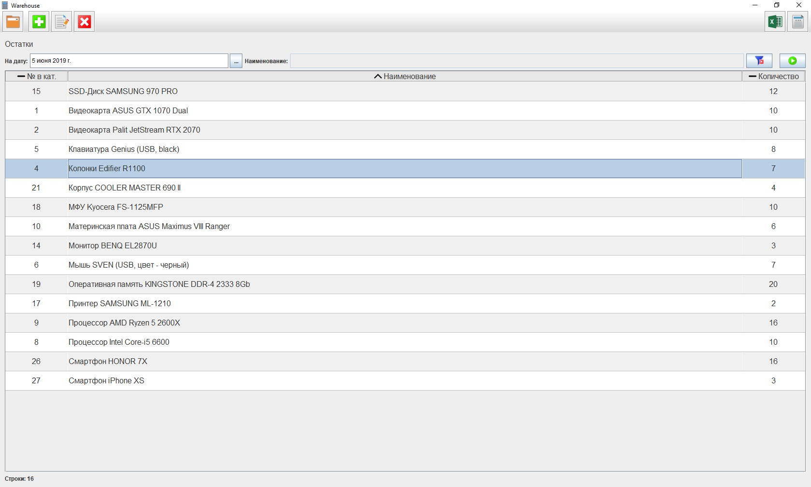

# Warehouse

Данный проект - программа позволяющая вести простейший количественный складской учет. Работая над ней я хотел, прежде всего, изучить
написание sql-инструкций для внесения согласованных изменений в таблицы БД и формирования сложных отчетов. Также много усилий пришлось
приложить к написанию компонентов интерфейса: прежде всего различных табличных компонентов, которые бы легко можно было встроить в другие 
компоненты - диалоговые окна и главное окно программы. Также, разрабатывая эти компоненты, я старался сделать так, чтобы обновление
данных в них можно было осуществить как можно проще - всего одним вызовом метода - а все остальные операции по отображению данных, такие 
как сортировка на экране, применение различных фильтров компонент делал бы сам. Кроме того, компоненты умеют выгружать свое содержимое 
в книги в формате xls (которые затем класс ActionHandler может сохранить на диск и открыть).

Состав классов программы такой:
1. MainClass - класс, с которого стартует выполнение приложения.Создает используемые программой экземпляры класса GUI, класса работы с БД    и класса, реализующего логику приложения.
2. DBHandler - класс, через который осуществляются все манипуляции с базой данных.
3. ActionHandler - класс, реализующий логику приложения. По сути представляет собой набор обработчиков событий от элементов интерфейса 
   главного окна, вынесенных в отдельный класс. Это позволило четко разделить GUI и код обработки событий по разным файлам.
4. Классы пакета data_elements. Данные классы представляют различные элементы данных, с которыми работает программа: документы, операции, 
   элементы каталога, контрагенты, элементы отчетов и т.п.
5. Классы SimpleDataTable, DocumentsTable, OperationsTable - служат для отображения основных логических элементов программы: документов,
   списков операций, каталога и контрагентов. Также они позволяют производить быстрый поиск среди отображаемых элементов.
6. Классы пакета report_components служат для задания параметров и дальнейшего отображения различных отчетов: по оборотам, по остаткам и      др.
7. Классы пакета dialog_components служат для отображения различных диалоговых окон: для отображения и редактирования отдельных              документов, для выбора из списков контрагентов и элементов каталога (номенклатуры), для ввода параметров операций. Методы этих классов    я хотел сделать похожими по функционалу на методы класса JOptionPane фреймворка Swing. То есть я вызываю метод и в возвращаемой ссылке    получаю выбранный пользователем объект или уже отредактированный документ. Максимум функциональности при минимуме усилий: просто          вызываешь метод, а он сам уже отображает нужное окно, запрашивает нужные параметры, а в вызывающий код возвращается уже подготовленный    корректный объект.

Также хочу сделать замечание о том, что классы из пунктов 5 и 6 во многом похожи по внутреннему устройству и, казалось бы, могли бы быть
объединены в один класс или в одну иерархию классов с абстрактным классом или интерфейсом на вершине. Я думал об этом, но сделать это
на самом деле было бы очень непросто, так как между классами также много и различий обусловленных тем, что работают они все же с разными элементами данных. Разные данные нужно по разному сортировать, к разным данным нужно применять разные фильтры, а к некоторым фильтры применать вообще не нужно (это касается таблиц с отчетами). Большое количество различий, которые необходимо бы было учесть сделало бы код запутанным и, в конечном итоге, ничего бы мне не дало. Я выбрал простоту, пускай и ценой некоторого дублирования элементов кода.

Скриншоты проекта ниже:

